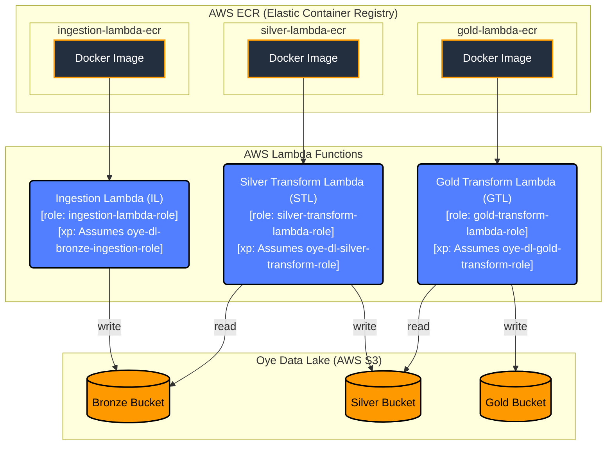

# Drill Data Analysis

[](https://github.com/Egbewattnkongho13/drill_data_analysis/actions/workflows/ci-lint.yml)
[](https://github.com/Egbewattnkongho13/drill_data_analysis/actions/workflows/ci-tests.yml)
[](https://github.com/Egbewattnkongho13/drill_data_analysis/actions/workflows/image-build2push.yml)

### Description
This project implements a serverless data processing pipeline on AWS for drill data analysis. It leverages AWS Lambda functions, Amazon S3 for data lake storage (Bronze, Silver, Gold layers), and Amazon ECR for Docker image management. The pipeline processes raw data, transforms it, and stores it in a structured format for analysis.

### Table of Content
- [Description](#description)
- [Architecture](#architecture)
- [Technologies Used](#technologies-used)
- [Getting Started](#getting-started)
  - [Prerequisites](#prerequisites)
  - [Installation & Setup](#installation--setup)
- [Usage](#usage)
- [CI/CD Pipelines](#cicd-pipelines)

### Architecture
The following diagram illustrates the architecture of the drill data analysis pipeline:



The architecture consists of three main components:
- **AWS ECR**: Stores Docker images for the Lambda functions.
- **AWS Lambda Functions**: Serverless compute services that perform ingestion, silver transformation, and gold transformation of data. Each Lambda assumes a specific role within the data lake for secure access.
- **Oye Data Lake (AWS S3)**: A tiered data lake with Bronze (raw data), Silver (cleaned and conformed data), and Gold (curated data for analysis) buckets.

### Technologies Used
- AWS Lambda
- Amazon S3
- Amazon ECR
- Terraform
- Python
- Docker
- Mermaid (for diagrams)

### Getting Started

### Prerequisites
- An AWS account with appropriate permissions.
- AWS CLI configured with your credentials.
- Terraform installed (version 1.0+ recommended).
- Docker installed and running.
- Python 3.8+ installed.
- Poetry (Python package manager) installed.

### Installation & Setup
1.  **Clone the repository:**
    ```bash
    git clone <https://github.com/Egbewattnkongho13/drill_data_analysis.git>
    cd drill_data_analysis
    ```
2.  **Configure AWS CLI:**
    Ensure your AWS CLI is configured with the necessary credentials and default region.
    ```bash
    aws configure
    ```
3.  **Build and Push Docker Images:**
    Navigate to each Lambda directory (`lambdas/ingestion`, `lambdas/silver-transform`, `lambdas/gold-transform`) and build/push the Docker images to ECR.
    ```bash
    # Example for ingestion lambda
    cd lambdas/ingestion
    docker build -t ingestion-lambda .
    aws ecr get-login-password --region <your-region> | docker login --username AWS --password-stdin <your-account-id>.dkr.ecr.<your-region>.amazonaws.com
    docker tag ingestion-lambda:latest <your-account-id>.dkr.ecr.<your-region>.amazonaws.com/ingestion-lambda-ecr:latest
    docker push <your-account-id>.dkr.ecr.<your-region>.amazonaws.com/ingestion-lambda-ecr:latest
    ```
    Repeat for `silver-transform` and `gold-transform` lambdas.

4.  **Deploy Infrastructure with Terraform:**
    Navigate to the Terraform environment directory (e.g., `infrastructure/envs/dev`).
    ```bash
    cd infrastructure/envs/dev
    terraform init
    terraform plan
    terraform apply
    ```
    Confirm the deployment by typing `yes` when prompted.

This will deploy the S3 buckets, ECR repositories, and Lambda functions.

### Local Development with Make

This project includes `Makefile`s to simplify common development tasks. The main `Makefile` in the root directory can be used to build and test all lambdas at once.

**Build all lambdas:**
```bash
make build-all
```

**Test all lambdas:**
```bash
make test-all
```

You can also build or test a specific lambda by specifying its name:

**Build a specific lambda:**
```bash
make build-ingestion
make build-silver-transform
make build-gold-transform
```

**Test a specific lambda:**
```bash
make test-ingestion
make test-silver-transform
make test-gold-transform
```

### Usage

This section provides instructions on how to use and interact with the deployed drill data analysis pipeline.

**1. Running Tests:**
To run unit tests for all lambdas at once:
```bash
make test-all
```
To run tests for a specific Lambda function:
```bash
make test-ingestion
# or
make test-silver-transform
# or
make test-gold-transform
```
You can also run `pytest` directly from within a lambda's directory:
```bash
cd lambdas/ingestion # or silver-transform, gold-transform
poetry run pytest
```

**2. Triggering the Pipeline:**
The pipeline is designed to be triggered by events, such as uploading a file to the Bronze S3 bucket.
- Upload a data file (e.g., CSV, JSON) to the `oye-dl-bronze-<env>` S3 bucket.
- The Ingestion Lambda will process it and move it to the Silver layer.
- The Silver Transform Lambda will process data in the Silver layer and move it to the Gold layer.
- The Gold Transform Lambda will process data in the Gold layer for final analysis.

**3. Local Development (Optional):**
For local development and testing of individual Lambda functions:
- Navigate to the specific Lambda directory (e.g., `lambdas/ingestion`).
- Build the Docker image:
  ```bash
  docker build -t <lambda-name>-lambda .
  ```
- Run the Docker container (adjust port mapping as needed):
  ```bash
  docker run -p 9000:8080 <lambda-name>-lambda
  ```
  You can then use tools like `curl` or a Lambda test client to invoke the local endpoint.

### CI/CD Pipelines

This project utilizes GitHub Actions for continuous integration and continuous deployment. The following workflows are configured:

- **`ci-lint.yml`**: Runs linting checks (e.g., `ruff`, `black`) on the codebase to ensure code quality and adherence to style guidelines. Triggered on every push and pull request.
- **`ci-tests.yml`**: Executes unit tests for all Lambda functions to ensure functionality and prevent regressions. Triggered on every push and pull request.
- **`image-build2push.yml`**: Builds Docker images for the Lambda functions and pushes them to Amazon ECR. This workflow is typically triggered manually or on specific branch pushes (e.g., `main`).
- **`terraform-deploy.yml`**: Deploys the AWS infrastructure (S3 buckets, ECR repositories, Lambda functions) using Terraform. This workflow is usually triggered manually or on pushes to the `main` branch after infrastructure changes.
- **`terraform-destroy.yml`**: Destroys the deployed AWS infrastructure. This is a sensitive workflow and should only be triggered manually with extreme caution.
