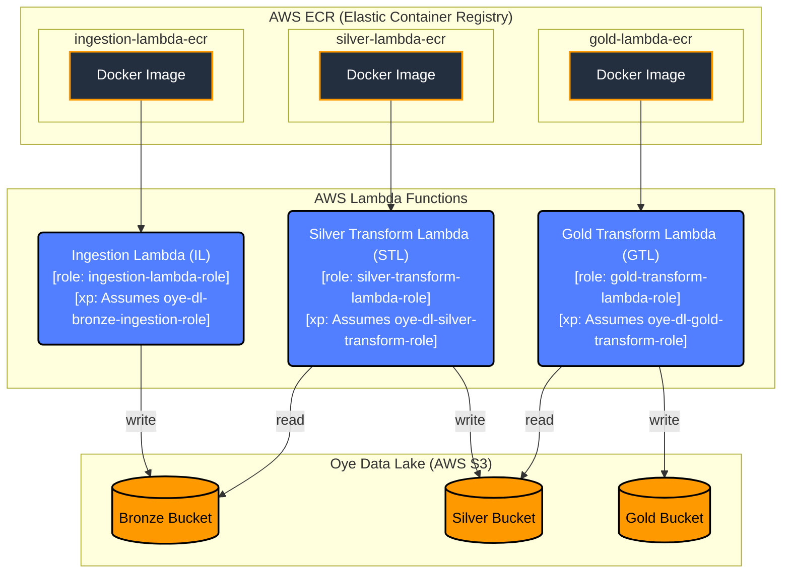

```mermaid
graph TD
    subgraph "AWS ECR (Elastic Container Registry)"
        subgraph "ingestion-lambda-ecr"
            DockerImageIngest["Docker Image"]
        end
        subgraph "silver-lambda-ecr"
            DockerImageSilver["Docker Image"]
        end
        subgraph "gold-lambda-ecr"
            DockerImageGold["Docker Image"]
        end
    end

    subgraph "AWS Lambda Functions"
        IngestionLambda("Ingestion Lambda (IL)<br/>[role: ingestion-lambda-role]<br/>[xp: Assumes oye-dl-bronze-ingestion-role]")
        SilverTransformLambda("Silver Transform Lambda (STL)<br/>[role: silver-transform-lambda-role]<br/>[xp: Assumes oye-dl-silver-transform-role]")
        GoldTransformLambda("Gold Transform Lambda (GTL)<br/>[role: gold-transform-lambda-role]<br/>[xp: Assumes oye-dl-gold-transform-role]")
    end

    subgraph "Oye Data Lake (AWS S3)"
        Bronze[("Bronze Bucket")]
        Silver[("Silver Bucket")]
        Gold[("Gold Bucket")]
    end

    DockerImageIngest --> IngestionLambda
    DockerImageSilver --> SilverTransformLambda
    DockerImageGold --> GoldTransformLambda

    IngestionLambda -->|write| Bronze
    SilverTransformLambda -->|read| Bronze
    SilverTransformLambda -->|write| Silver
    GoldTransformLambda -->|read| Silver
    GoldTransformLambda -->|write| Gold

    classDef bucket fill:#FF9900,stroke:#000,stroke-width:2px,color:#000
    classDef lambda fill:#527FFF,stroke:#000,stroke-width:2px,color:#fff
    classDef ecr fill:#f9f9f9,stroke:#333,stroke-width:2px,color:#000
    classDef image fill:#232F3E,stroke:#FF9900,stroke-width:2px,color:#fff

    class Bronze,Silver,Gold bucket
    class IngestionLambda,SilverTransformLambda,GoldTransformLambda lambda
    class DockerImageIngest,DockerImageSilver,DockerImageGold image
```